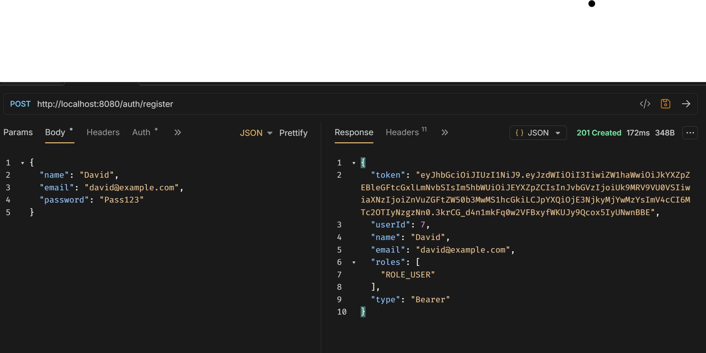
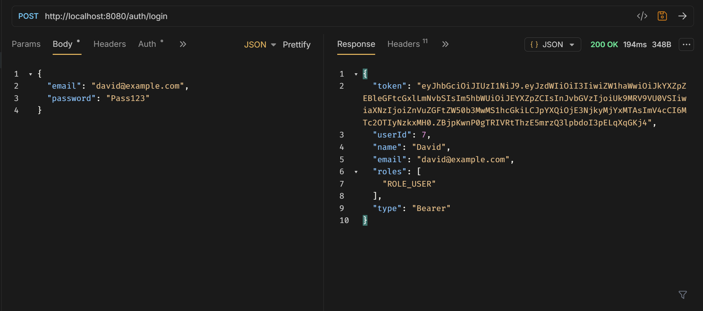
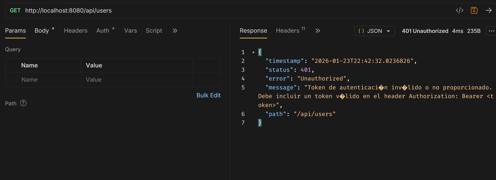
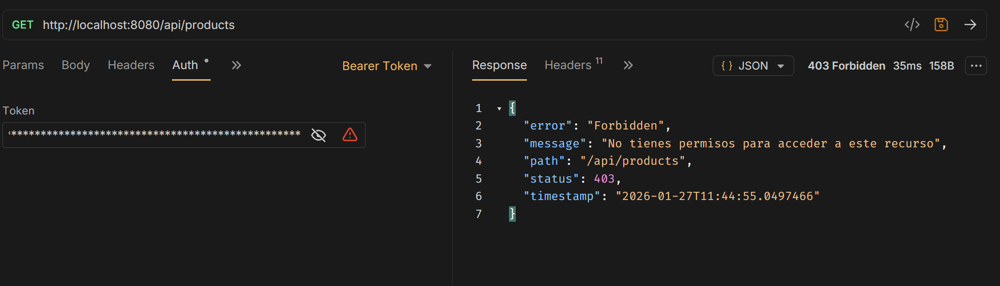
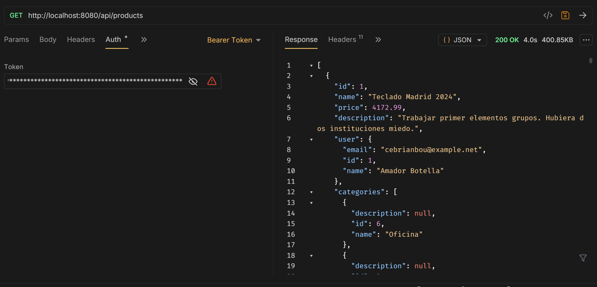
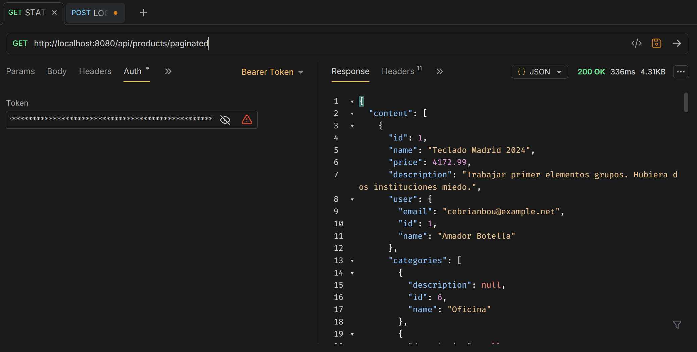
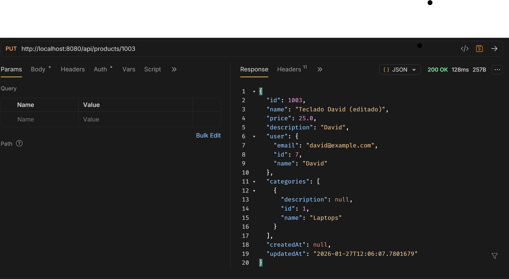
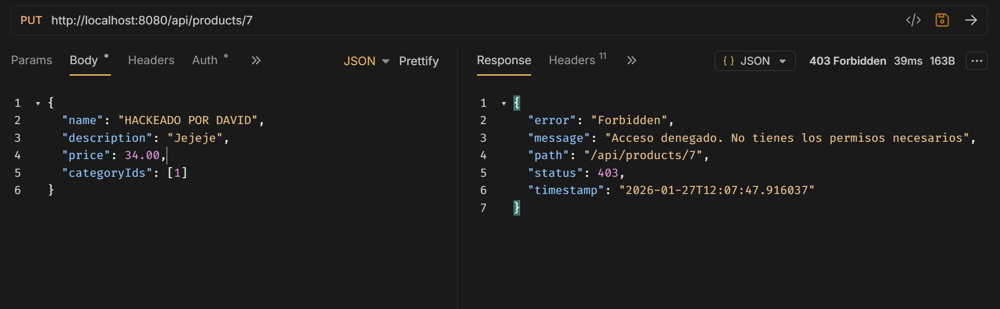

# Práctica 10: Paginación Avanzada con Spring Boot

## 📋 Descripción
Implementación de estrategias de paginación eficiente (Page vs Slice), filtrado dinámico y ordenamiento seguro en una API REST con Spring Boot y PostgreSQL.

## 🚀 Tecnologías
* Java 17 / Spring Boot 3
* Spring Data JPA
* PostgreSQL
* Python (Scripts de prueba y data seeding)

## 📸 Evidencias de Funcionamiento

### 1. Validación de Requisitos (Script Automatizado)
El sistema cumple con el 100% de los requisitos técnicos, incluyendo seguridad en ordenamiento y optimización de consultas.

### 2. Diferencia entre Page y Slice

**Respuesta PAGE (Con conteo total):**
Se observa la estructura estándar de paginación completa.

**Respuesta SLICE (Optimizado):**
Respuesta ligera sin conteo total (`totalElements`), ideal para rendimiento y "Infinite Scroll".

## ⚡ Análisis de Rendimiento (Performance)

Se realizó una prueba de carga comparando los tiempos de respuesta entre `Page` y `Slice` sobre un dataset de 1000 registros.

**Resultado:** Slice demostró ser un **36.1% más rápido** al evitar la consulta `COUNT(*)` a la base de datos (16.30ms vs 25.51ms).

## 🏁 Conclusiones
Esta implementación demuestra cómo Spring Data JPA permite manejar grandes volúmenes de datos de manera eficiente. La elección entre `Page` y `Slice` permite equilibrar la experiencia de usuario con el rendimiento del servidor, manteniendo siempre la seguridad contra inyecciones en el ordenamiento.

## 🔐 Pruebas de Seguridad (JWT)

A continuación se evidencia el funcionamiento del sistema de autenticación y autorización.

### 1. Registro de Usuario (Generación de Token)
Al registrar un usuario, el sistema devuelve automáticamente un token JWT para iniciar sesión inmediatamente sin pasos extra.
**Endpoint:** `POST /auth/register`

### 2. Inicio de Sesión (Login)
El usuario envía sus credenciales y recibe un token firmado (JWT) que deberá enviar en el header `Authorization` de las siguientes peticiones.
**Endpoint:** `POST /auth/login`

### 3. Protección de Endpoints (Acceso Sin Token)
Intento de acceso a un recurso protegido (`/api/users`) sin enviar el token JWT.
El sistema intercepta la petición mediante `JwtAuthenticationEntryPoint` y responde con un **401 Unauthorized** y un mensaje de error estructurado, protegiendo los datos.
**Endpoint:** `GET /api/users` (Sin Header Authorization)

## 🛡️ Control de Acceso por Roles (RBAC)

Implementación de seguridad granular utilizando `@PreAuthorize`. Se diferencia entre usuarios normales y administradores.

### 1. Protección de Rutas Administrativas
Un usuario con `ROLE_USER` intenta acceder al endpoint de listado completo (`GET /api/products`), el cual está restringido solo para administradores.
**Resultado:** El sistema deniega el acceso con un `403 Forbidden`.

### 2. Acceso de Administrador
Un usuario con `ROLE_ADMIN` accede al mismo endpoint protegido.
**Resultado:** El sistema permite el acceso y devuelve la data sensible.
 

---

## 👤 Validación de Ownership (Propiedad)

Implementación de lógica de negocio para asegurar que **solo el dueño del recurso** (o un Admin) pueda modificarlo o eliminarlo.

### 1. Modificación Legítima (Dueño)
El usuario intenta modificar un producto que le pertenece (su ID coincide con el `owner_id` del producto).
**Resultado:** Operación exitosa (`200 OK`).

### 2. Bloqueo de Modificación Ilegítima (Seguridad)
Un usuario intenta modificar un producto que **NO** le pertenece (intento de acceso cruzado). El servicio valida la propiedad antes de ejecutar la acción.
**Resultado:** El sistema lanza una excepción de seguridad personalizada con el mensaje *"No puedes modificar productos ajenos"*.
