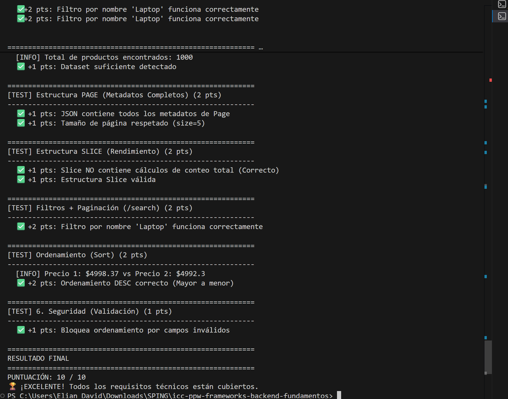
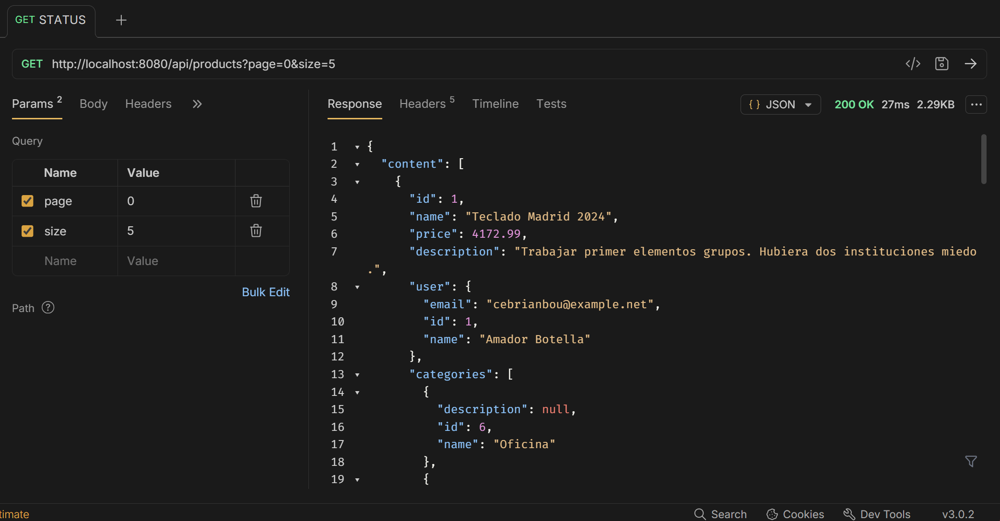
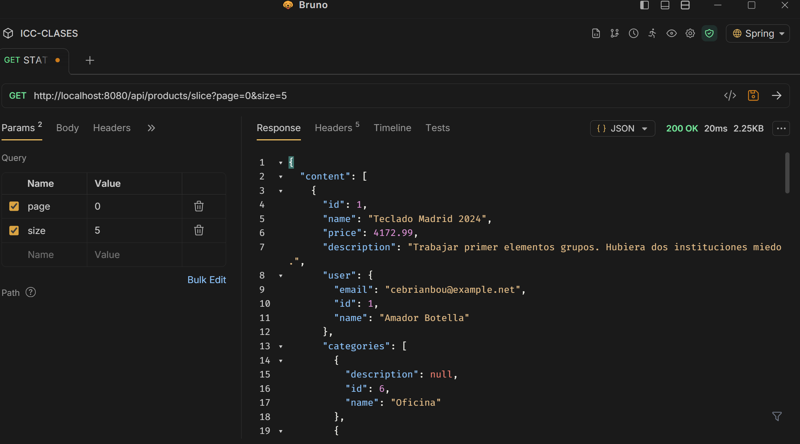
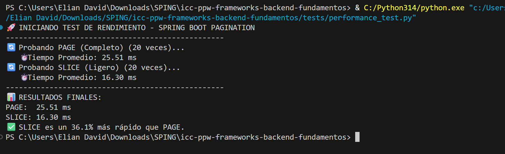

# Práctica 10: Paginación Avanzada con Spring Boot

## 📋 Descripción
Implementación de estrategias de paginación eficiente (Page vs Slice), filtrado dinámico y ordenamiento seguro en una API REST con Spring Boot y PostgreSQL.

## 🚀 Tecnologías
* Java 17 / Spring Boot 3
* Spring Data JPA
* PostgreSQL
* Python (Scripts de prueba y data seeding)

## 📸 Evidencias de Funcionamiento

### 1. Validación de Requisitos (Script Automatizado)
El sistema cumple con el 100% de los requisitos técnicos, incluyendo seguridad en ordenamiento y optimización de consultas.

### 2. Diferencia entre Page y Slice

**Respuesta PAGE (Con conteo total):**
Se observa la estructura estándar de paginación completa.

**Respuesta SLICE (Optimizado):**
Respuesta ligera sin conteo total (`totalElements`), ideal para rendimiento y "Infinite Scroll".

## ⚡ Análisis de Rendimiento (Performance)

Se realizó una prueba de carga comparando los tiempos de respuesta entre `Page` y `Slice` sobre un dataset de 1000 registros.

**Resultado:** Slice demostró ser un **36.1% más rápido** al evitar la consulta `COUNT(*)` a la base de datos (16.30ms vs 25.51ms).

## 🏁 Conclusiones
Esta implementación demuestra cómo Spring Data JPA permite manejar grandes volúmenes de datos de manera eficiente. La elección entre `Page` y `Slice` permite equilibrar la experiencia de usuario con el rendimiento del servidor, manteniendo siempre la seguridad contra inyecciones en el ordenamiento.